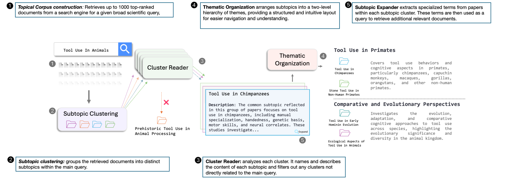

<p align="center">
  
</p>

# Knowledge Navigator: LLM-guided Browsing Framework for Exploratory Search in Scientific Literature
<p align="center">
<a href="https://knowledge-navigators.github.io/"><b>Website</b></a> 🐋 <a href="https://knowledge-navigator.streamlit.app/"><b>Streamlit demo</b></a> 🐋️ <a href="https://www.arxiv.org/abs/2408.15836"><b>Paper</b></a> 
</p>

## System Overview
<p align="center">
  
</p>
Knowledge Navigator system takes a corpus of retrieved scientific documents for a given query and outputs an organized two-level thematic structure of subtopics spanning that topical query. The system's functionality is supported by the following conceptual steps: corpus construction, embedding and clustering of documents, describing and naming clusters, filtering irrelevant clusters, grouping the clusters into a thematic hierarchy, and subtopic query generation. This is implemented in a five-component architecture that largely follows the conceptual steps. This architecture enables LLMs to generate grounded outputs based on a large number of source documents, a crucial requirement for organizing and structuring large corpora.

## Folders

- `Navigator`: This folder contains all the code necessary to run Knowledge Navigator locally.
- `Benchmarks`: This folder includes the CLUSTREC-COVID and SCITOC benchmarks used for evaluating the system.


## Citation
Please cite our paper if you use this code in your own work:
```bibtex
@article{katz2024knowledge,
  title={Knowledge Navigator: LLM-guided Browsing Framework for Exploratory Search in Scientific Literature},
  author={Katz, Uri and Levy, Mosh and Goldberg, Yoav},
  journal={arXiv preprint arXiv:2408.15836},
  year={2024}
}
```
